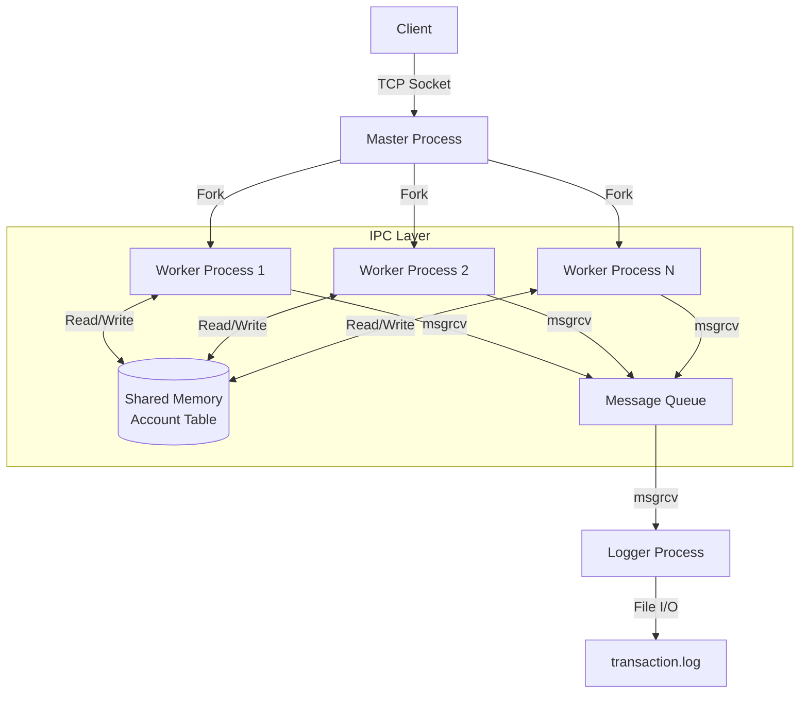

# High-Concurrency Safe Transfer System (HSTS)

## Project Overview

HSTS is a robust, high-performance banking simulation system designed to demonstrate mastery of **System Programming** concepts. It features a custom application-layer protocol, multi-process architecture, and strict ACID transaction compliance using IPC mechanisms.

**Key Technical Features:**

- **Architecture:** Pre-forking Process Pool (Master-Worker Model)
- **IPC:** Shared Memory (State Storage), Message Queues (Async Logging), Semaphores (Locking)
- **Concurrency:** Handling 100+ concurrent connections with Deadlock Prevention (Resource Ordering)
- **Protocol:** Custom Binary Protocol with Checksum and Magic Bytes

---

## System Architecture



---

## Build & Run

### Prerequisites

- GCC / Clang
- Make
- Linux Environment (Ubuntu/WSL2 recommended)

### Compilation

```bash
make clean
make all
```

### Running the System

**1. Start the Server:**

```bash
./server
# The server will initialize SHM, Semaphores, and listen on Port 8080.
```

**2. Run the Client (Interactive Mode):**

```bash
./client
```

**3. Run Stress Test (Auto Mode):**

```bash
./client --stress
# Launches 100 threads to simulate high-concurrency transfers.
```

---

## Team Roles & Contributions

| Role | Member Name | Responsibilities | Files Owned |
|------|-------------|------------------|-------------|
| Orchestrator | 陸紀霖 | Network Layer, Protocol Parsing, Process Management | `server.c`, `network.c`, `protocol.c` |
| Bank Core | @Member2 | ACID Logic, Shared Memory, Deadlock Prevention Algorithm | `bank.c`, `shm_manager.c` |
| Auditor | @Member3 | Async Logging, Message Queue Management, File Persistence | `logger.c`, `mq_manager.c` |
| QA / Tester | @Member4 | Stress Testing, Client CLI, Multi-threaded Load Generation | `client.c` |

---

## License

Academic Project - [System Programming & Security] Fall 2025