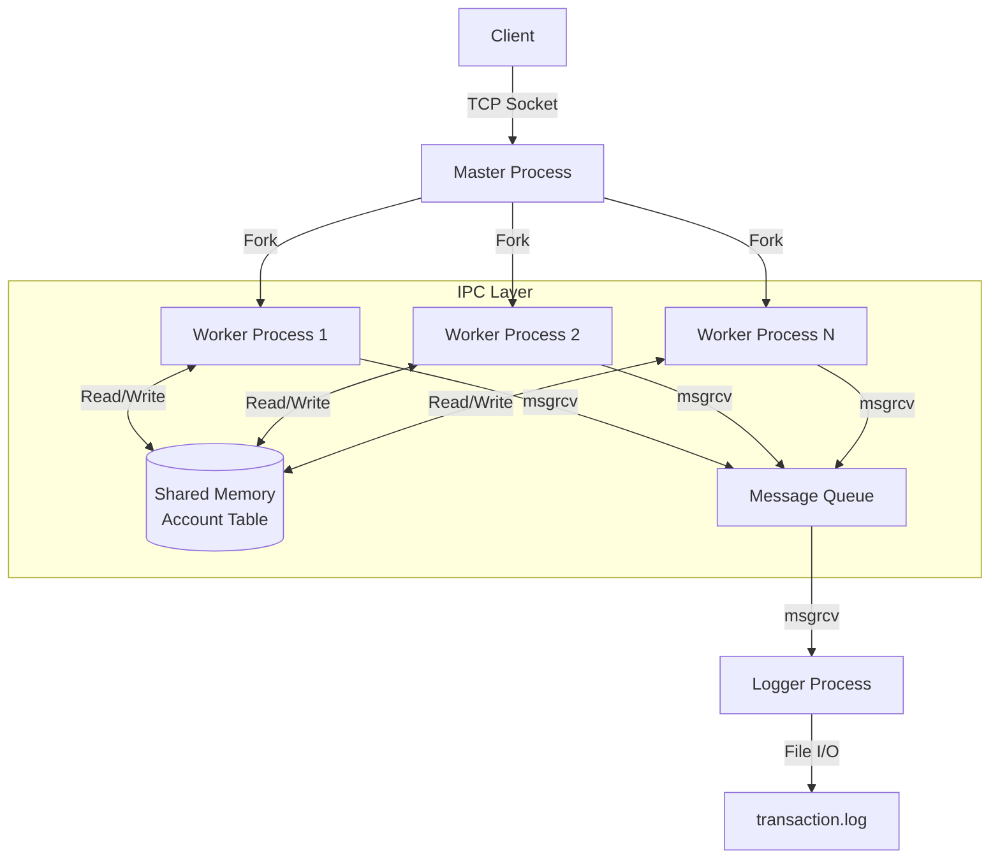

# High-Concurrency Safe Transfer System (HSTS)

## Project Overview

HSTS is a robust, high-performance banking simulation system designed to demonstrate mastery of **System Programming** concepts. It features a custom application-layer protocol, multi-process architecture, and strict ACID transaction compliance using IPC mechanisms.

**Key Technical Features:**

- **Architecture:** Pre-forking Process Pool (Master-Worker Model)
- **IPC:** Shared Memory (State Storage), Message Queues (Async Logging), Semaphores (Locking)
- **Concurrency:** Handling 100+ concurrent connections with Deadlock Prevention (Resource Ordering)
- **Protocol:** Custom Binary Protocol with Checksum and Magic Bytes

---

## System Architecture



---

## Project File Structure

```text
.
├── github/workflows/          # [Orchestrator] GitHub Actions Workflows
├── AGENTS.md                  # [Orchestrator] AI Agent Rules
├── CMakeLists.txt             # [Orchestrator] Root Build Configuration
├── LICENSE
├── README.md                  # [Orchestrator] Project Documentation
├── bin/                       # [Generated] Output Executables
├── build/                     # [Generated] Build Artifacts
├── docs/                      # [Orchestrator] Project Documentation
│   ├── git-cowork-guidence.md # [Orchestrator] Git Collaboration Guidance
│   ├── prd.md                 # [Orchestrator] Product Requirements Document
│   └── project_spec.md        # [Orchestrator] Technical Specification
├── include/                   # [Orchestrator] Header Files
│   ├── bank.h                 # [Bank Core] Banking Logic Interfaces
│   ├── logger.h               # [Auditor] Logging Interfaces
│   ├── protocol.h             # [Orchestrator] Protocol Definitions
│   └── utils.h                # [Orchestrator] Utility Functions
├── lib/                       # [Generated] Output Libraries
├── logs/                      # [Generated] Runtime Logs
│   └── transaction.log        # [Auditor] Transaction History Log
├── src/                       # Source Code
│   ├── client/
│   │   ├── CMakeLists.txt
│   │   └── main.c             # [QA/Tester] Client Application Entry Point
│   ├── common/
│   │   ├── CMakeLists.txt
│   │   ├── bank_logic.c       # [Bank Core] Banking Logic implementation
│   │   ├── logger.c           # [Auditor] Async Logging implementation
│   │   ├── mq_wrapper.c       # [Auditor] Message Queue Wrapper
│   │   ├── protocol.c         # [Orchestrator] Protocol Implementation
│   │   └── shm_wrapper.c      # [Bank Core] Shared Memory Implementation
│   └── server/
│       ├── CMakeLists.txt
│       └── main.c             # [Orchestrator] Server Application Entry Point
└── tests/                     # Unit & Integration Tests
    ├── CMakeLists.txt
    ├── test_bank.c            # [Bank Core] Bank Logic Tests
    ├── test_logger.c          # [Auditor] Logger Tests
    ├── test_monitor.c         # [QA] System Monitoring Tests
    ├── test_robust_crash.c    # [QA] Robustness / Crash Recovery Tests
    └── tests.sh               # [QA] Automated Build & Test Script
```

---

## Build & Run

### Prerequisites

- GCC / Clang
- CMake (3.10+)
- Linux Environment (Ubuntu/WSL2 recommended)

### Compilation

```bash
mkdir -p build
cd build
cmake ..
make
```

### Running the System

**1. Start the Server:**

```bash
./bin/server
# The server will initialize SHM, Semaphores, and listen on Port 8080.
```

**2. Run the Client (Interactive Mode):**

```bash
./bin/client
```

**3. Run Stress Test (Auto Mode):**

```bash
./bin/client --stress
# Launches 100 threads to simulate high-concurrency transfers.
```

---

## Development Workflow

To ensure code stability, please follow this workflow for development and testing.

### 1. Build Environment Setup

We use `cmake` for build management. Always perform builds in the `build/` directory.

```bash
# 1. Create build directory
mkdir -p build
cd build

# 2. Generate Makefiles
cmake ..

# 3. Compile
make
```

### 2. Testing Your Changes

Before pushing code, run the relevant unit tests found in the `bin/` directory.

**For Bank Core Logic (ACID/Transactions):**
```bash
./bin/test_bank
```

**For Logger & IPC:**
```bash
./bin/test_logger
```

### 3. Clean Rebuild

If you modify `CMakeLists.txt` or add new source files, perform a clean build:

```bash
rm -rf build/*
cd build
cmake ..
make
```

## Team Roles & Contributions

| Role | Member Name | Responsibilities | Files Owned |
|------|-------------|------------------|-------------|
| Orchestrator | @lujames13 | Architecture Design, Protocol Parsing, Server Implementation | `server/main.c`, `common/protocol.c` |
| Bank Core | @hank77-zeng | ACID Logic, Shared Memory, Deadlock Prevention Algorithm | `common/bank_logic.c`, `common/shm_wrapper.c` |
| Auditor | @tienli0312 | Async Logging, Message Queue Management, File Persistence | `common/logger.c`, `common/mq_wrapper.c` |
| QA / Tester | @A13-Yang | Integration, Stress Testing, Client CLI, Multi-threaded Load Generation | `client/main.c`, `tests/*` |

---

## License

Academic Project - [System Programming & Security] Fall 2025
